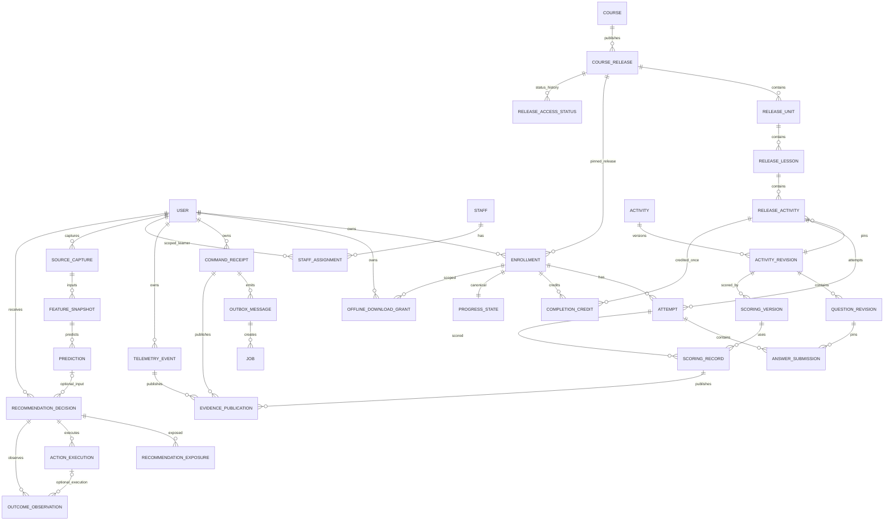

# 11 — Logical ERD V3

## Important uniqueness

- command receipt: `(learner_id, command_id)`
- completion credit: `(enrollment_id, release_activity_id)`
- exposure: `(learner_id, exposure_id)`
- evidence publication: `(source_type, source_id, source_revision)`
- outbox handler effect: `(outbox_message_id, handler_type, handler_version)`
