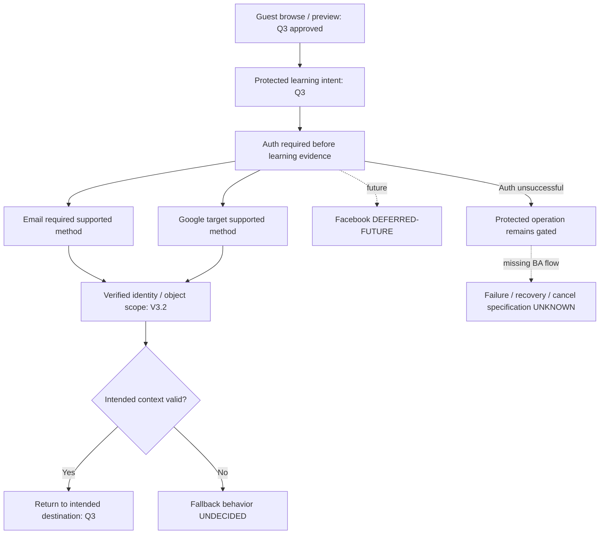

# Account lifecycle synchronization candidate — AUD-005

**HIGH / OPEN; gate blocking.** Q3 has decided whether authentication is required before learning evidence. That inclusion question is closed by PO authority. This does not yet establish the missing actual workbook's minimum lifecycle flows, all required P0 paths, acceptance states or failure/recovery/privacy request behavior. No auth code or tests were changed.

This is candidate documentation, not a replacement canonical workbook or approved additional account policy. The rules below synchronize existing PO/V3.2 meaning. No fictional formal Req/BR/Trigger/UC IDs are assigned. A source pointer can carry several semantic nodes when it explicitly defines their relationship; missing implementation UI may be deferred, but missing required business definition remains visible.

| Account Capability | Status | Requirement | BR | Trigger | UC | Screen/State | Test/AC | Source | Gap |
| --- | --- | --- | --- | --- | --- | --- | --- | --- | --- |
| Guest browse | APPROVED | Q3; PRD13 browse is semantically supported | Q3 guest preview / no learning evidence | Guest opens Welcome/demo Home/catalog/course/lesson preview | Q3 browse flow; J-L08 preview subset | L-002/L-010 demo/L-040/L-042; guest variant not explicit in catalog | AC-A01; NOT EXECUTED auth/guest runtime | Q3 | Guest variants/gate not in full existing BA chain; formal Req/BR/Trigger/UC/WF IDs UNKNOWN |
| Registration | APPROVED account gate; detailed creation flow UNDECIDED | Q3 account requirement; no explicit registration Req ID | Verified identity before protected learning | Guest chooses account creation before protected action | Candidate intent: guest→auth→valid intended context; registration steps UNKNOWN | No registration screen in actual repo catalog | AC-A02/A03; create-account-specific AC missing | Q3 / V3.2 docs07 | No approved creation/failure/minimum credential flow; cannot assert every P0 path defined |
| Login | APPROVED | Q3; formal Req UNKNOWN | Auth before protected operation; verified owner | Guest/returning user requests protected action | Q3 auth gate and return; exact login UC UNKNOWN | L-064 reauth support only; no explicit login screen | AC-A02/A03/A05; NOT EXECUTED runtime | Q3 / V3.2 docs07 | Success/failure/session implementation later; full BA failure journey missing |
| Email auth | APPROVED | Q3 method; formal Req UNKNOWN | Email required supported method | Choose supported Email method | Q3 method scope; exact mechanism UNDECIDED | No Email-auth screen/state in catalog | AC-A04; NOT EXECUTED | Q3 | Email does not imply password/OTP/magic-link, mandatory verification or policy; do not invent |
| Google auth | APPROVED target supported method | Q3; formal Req UNKNOWN | Google target supported method | Choose Google auth | Q3 method scope; provider-link behavior UNDECIDED | No Google-auth screen/state in catalog | AC-A04; NOT EXECUTED | Q3 | Provider linking/unlinking and failure path await approved policy; implementation GĐ4 |
| Facebook future | DEFERRED | Q3 / Q12 | OUT OF CURRENT MVP IMPLEMENTATION; not permanently rejected | Future only | DEFERRED-FUTURE | NOT APPLICABLE current UI | AC-A04 scope only; no implementation test needed now | Q3 | No current gap; no permanent rejection |
| Logout | UNDECIDED minimum business flow; implementation DEFERRED | No explicit repo/workbook Req available | V3.2 requires verified identity; logout/pending-queue policy not specified | User chooses sign out | Exact UC UNKNOWN | No logout state in catalog | No approved logout AC; NOT EXECUTED | V3.2 docs07 gives authority only | Cannot infer local pending-work retention, revoke scope or cross-device logout; minimum scope remains unresolved |
| Session restoration | REQUIRED BY V3.2 CONTRACT: verified identity; exact lifecycle UNDECIDED | Q3/Q7 returning intent; formal Req UNKNOWN | Restore must still respect verified owner; expiry unspecified | Returning user / app restart | J-L12 learning Resume is not an auth-session restoration UC | L-001 bootstrap/L-033 learning Resume/L-064 reauth; support only | AC-A05; NOT EXECUTED auth restore | V3.2 docs07 / Q3 / Q7 | No canonical auth session-success/failure flow; no inferred expiry |
| Authentication failure | REQUIRED BY V3.2 CONTRACT authority; flow UNDECIDED | Q3; no formal failure Req | No verified auth → no protected evidence/access; semantic consequence, not invented retry cap | Authentication fails or unavailable | Gate remains unsatisfied; failure/retry/cancel journey UNKNOWN | L-064 required/error; generic L-062 is not login failure proof | AC-A02/A05; no executed auth failure test | Q3 / V3.2 docs07 | User failure/recovery handling not complete; no guessed error taxonomy or retry limits |
| Recovery | UNDECIDED minimum capability; exact policy DEFERRED to GĐ4 decision | No explicit approved recovery Req | Credential proof/mechanism not specified | Cannot authenticate with selected method | Recovery UC UNKNOWN | No recovery screen/state | No recovery AC; NOT EXECUTED | No source determines policy; Q3 defines supported methods only | Need source/accountability before minimum recovery scope; exact windows deferred, not marked designed |
| Reauthentication | EXPLICIT IN REPO; sensitive-action policy UNDECIDED | L-064 offline/sync support; V3.2 owner auth | Receipt/grant access requires current valid auth; sensitive reauth policy unknown | Reauth-required state | Offline UX reauth support, not blanket sensitive-action UC | L-064 required/error; L-060 reauth | AC-A05/A06; presentation suite only | V3.2 docs07 / catalog L-064 / offline UX | Do not invent mandatory sensitive-action challenge; classify applicability at GĐ4 |
| Device change | REQUIRED BY V3.2 CONTRACT owner/device grant boundaries; BA restore flow UNDECIDED | Q3/Q7 intent; exact Req UNKNOWN | Server owns history; local grant bound to device installation/package | Different device / restore server-backed learner state | No explicit account device-restore UC | L-033 learning Resume not proof of cross-device restore | AC-A05/A06; NOT EXECUTED cross-device runtime | V3.2 docs07 Offline grant / Q7 | Concurrent-device policy/recovery window deferred; client cannot declare another device synced |
| Account unavailable/state | UNDECIDED / applicability UNKNOWN | No available account-state Req | Auth required, but suspension/deactivation semantics not specified | Account unavailable if such states are scoped | Unknown applicable state transition | Generic error L-062/L-064 is not suspension flow | No state-specific AC; NOT EXECUTED | Q3 / V3.2 docs07 does not decide suspension | No invented account suspension or deactivation; scope must be verified from workbook |
| Profile/preferences | APPROVED; EXPLICIT IN REPO | PRD10 / Q4 | Optional goal preference; no history/eligibility rewrite | View/edit optional goal/profile | J-L11 + Q4; goal editing on L-052 | L-050/L-051/L-052/L-053; durable Progress auth gate Q3 | AC-A07; PRD10 QA-LRN-017/QA-BIZ-008 spec; fixture suite executed | Q3/Q4 / PRD10 | AUD-009 existing default/missing-goal fixture debt retained; actual account trace UNKNOWN |
| Delete account | REQUIRED BY V3.2 CONTRACT boundary; request UX/policy UNDECIDED | V3.2 docs10; formal Req UNKNOWN | Subject-generation/atomic publish/delete; replay deletion ledger before reopening restore | Deletion requested | Contract request/status/control, not completed learner UC | No learner deletion screen/state | AC-A08; original contract/SQL suite executed; native multi-session/runtime NOT EXECUTED | V3.2 docs10 | No completed request/auth/status/failure BA chain; grace/recovery window not invented |
| Export data | REQUIRED BY V3.2 CONTRACT boundary; request UX/policy UNDECIDED | V3.2 docs10; formal Req UNKNOWN | Pin generation; recheck with shared lock; abort/clean on deletion; block download when requested | Subject export request | Contract export-job boundary; learner UC UNKNOWN | No export request/result/failure screen | AC-A08; original contract/SQL suite executed; production export NOT EXECUTED | V3.2 docs10 | No invented export SLA; request/privacy scope and necessary AC chain not complete |
| Return-to-intended-destination | APPROVED | Q3; formal Req UNKNOWN | Return only if technically/semantically valid; V3 owner/eligibility respected | Successful authentication with stored intended context | Q3 guest→protected intent→auth→valid destination | No explicit auth-destination state chain; L-033 is learning Resume only | AC-A03; NOT EXECUTED auth routing | Q3 / V3.2 docs07 | Invalid-context fallback destination UNDECIDED; no invented route/timeout/linking behavior |

## Source-derived acceptance candidate

- **AC-A01 — specification-only candidate, NOT EXECUTED:** Given guest browse of Welcome/demo Home/catalog/course/lesson preview, browsing remains allowed; no learning state/evidence created. Source: [PO_TARGETED_REQUEST.txt · Q3 —](C:/Mingo/03_Kiem_thu/Bang_chung/gd1_targeted_closure_20261005/PO_TARGETED_REQUEST.txt:243).
- **AC-A02 — specification-only candidate, NOT EXECUTED:** Given guest invokes Start Learning/Attempt/independent Check/durable Progress/offline learning download/learning sync, authentication must precede the protected operation. Source: [PO_TARGETED_REQUEST.txt · Q3 —](C:/Mingo/03_Kiem_thu/Bang_chung/gd1_targeted_closure_20261005/PO_TARGETED_REQUEST.txt:243).
- **AC-A03 — specification-only candidate, NOT EXECUTED:** Given successful authentication and technically/semantically valid intended context, resume that context; no prerequisite or ownership bypass. Source: [PO_TARGETED_REQUEST.txt · Q3 —](C:/Mingo/03_Kiem_thu/Bang_chung/gd1_targeted_closure_20261005/PO_TARGETED_REQUEST.txt:243).
- **AC-A04 — specification-only candidate, NOT EXECUTED:** Email is a required supported authentication method; Google is target supported; Facebook is DEFERRED-FUTURE. Source: [PO_TARGETED_REQUEST.txt · Q3 —](C:/Mingo/03_Kiem_thu/Bang_chung/gd1_targeted_closure_20261005/PO_TARGETED_REQUEST.txt:243).
- **AC-A05 — specification-only candidate, NOT EXECUTED:** Identity/role/object scope derive from verified auth; learner may access only own enrollment/attempt/receipt/grant. Source: [07_SECURITY_PERMISSION_V3.md · Server authority](C:/Mingo/02_Tai_lieu_du_an/05_Kien_truc_he_thong/contracts/v3_2/source/docs/07_SECURITY_PERMISSION_V3.md:3).
- **AC-A06 — specification-only candidate, NOT EXECUTED:** Offline grant/receipt require authenticated owner and contract context; network restored is not synced. Source: [PO_TARGETED_REQUEST.txt · Q10 —](C:/Mingo/03_Kiem_thu/Bang_chung/gd1_targeted_closure_20261005/PO_TARGETED_REQUEST.txt:380).
- **AC-A07 — specification-only candidate, NOT EXECUTED:** Goal remains optional/editable preference and cannot rewrite history/mastery or bypass prerequisites. Source: [PO_TARGETED_REQUEST.txt · Q4 —](C:/Mingo/03_Kiem_thu/Bang_chung/gd1_targeted_closure_20261005/PO_TARGETED_REQUEST.txt:287).
- **AC-A08 — specification-only candidate, NOT EXECUTED:** Deletion/export/publish share V3.2 subject-generation race/lock gate; export download blocked once deletion requested; restore closed until ledger reconciliation. Source: [10_RETENTION_DELETE_RESTORE_V3.md · V3.2 atomic deletion/publish gate](C:/Mingo/02_Tai_lieu_du_an/05_Kien_truc_he_thong/contracts/v3_2/source/docs/10_RETENTION_DELETE_RESTORE_V3.md:41).

## Approved gate flow and state boundary

Guest may preview the approved surfaces. When requesting a protected learning operation, authentication must precede that operation; identity/object scope comes from verified auth. Successful auth returns to intended context only if technically/semantically valid. Failure to authenticate does not authorize the protected operation. Exact recovery/cancel/invalid-destination UI and session mechanics are not supplied by Q3; they remain explicit gaps rather than guessed product behavior. Neither opening a preview nor a retry creates canonical progress.

## Policy questions and safe deferral

| Policy | Classification | Reason | Target / owner |
| --- | --- | --- | --- |
| Mandatory email verification; Email mechanism | UNDECIDED; exact mechanism deferred | Q3 requires supported Email, not password/OTP/magic-link or mandatory verification. | GĐ4 identity BA/design before implementation; PO + security owner |
| Exact recovery proof/window | UNDECIDED; exact policy deferred | No approved recovery mechanism; do not invent. Minimum recovery capability/flow still requires source confirmation. | GĐ4 identity BA/design; PO + security owner |
| Session expiry/concurrent devices/logout revocation | UNDECIDED; exact numbers/policy deferred | Verified owner boundary known; session mechanics are not fixed. Minimum returning/logout flow remains a BA gap. | GĐ4; PO + Tech Lead |
| Suspended/deactivated account behavior | Applicability UNKNOWN | Do not invent account states. Inspect actual workbook before requesting a new rule. | Workbook reconciliation, then GĐ4 if necessary |
| Export SLA; deletion grace/recovery window | Exact policy deferred; contract controls REQUIRED | V3.2 generation/race/restore semantics remain fixed. Deferring SLA does not waive learner request/auth/status/failure BA. | Before GĐ4/data-rights implementation and external pilot; PO + privacy reviewer |
| Provider linking/unlinking | DEFERRED decision | Supported Email/Google does not determine linking semantics. Not necessary to synchronize Q3. | GĐ4 before introducing provider-link feature; PO + security owner |

No new CR-GD1-001 is raised for copying the approved Account Gate, methods, Home order or other Q4–Q11 principles. The old broad scope CR is superseded **within the candidate** as NOT REQUIRED for those decisions. No evidence proves a new semantic amendment is necessary now: first inspect the actual workbook. If necessary minimum business policy remains undecided after reconciliation, a narrowly scoped DRAFT CR must state the exact question, affected P0 path and alternatives; no automatic approval or invented answer.

## AUD-005 closure checklist

| Condition | Result |
| --- | --- |
| Account Gate traceable | PASS at PO/V3.2/source-derived candidate level (AC-A01..06); formal workbook chain UNKNOWN |
| Minimum MVP account behavior scoped | PARTIAL: protected learning boundary/methods/return intent approved; full creation/logout/restore/recovery/request flows unavailable |
| Every necessary lifecycle specified/deferred/escalated | PARTIAL: exact policy decisions deferred; necessity and completeness of minimum behavior cannot be proven from missing workbook |
| No P0 learning path depends on undefined auth behavior | UNKNOWN: actual priority/requirements absent; cannot certify this condition |
| Deletion/export/privacy not falsely implemented | PASS reporting boundary: contract/spec/check differs from runtime/learner flow |
| Auth implementation later GĐ4/appropriate stage | DEFERRED; engineering Phase3 remains HOLD, distinct numbering |
| No auth implementation in this task | PASS source preservation; no source edits |

AUD-005 stays HIGH/OPEN because required closure conditions remain unverified. The blocker is incomplete available BA evidence, not whether account is required or absence of runtime Auth. Exact numeric policies alone do not become GĐ1 blockers; the missing minimum paths/source completeness do.
